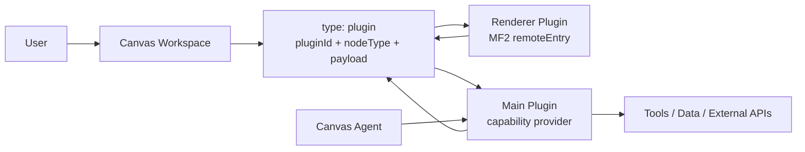

# AI-Native Software Lego: Vision, Design, Roadmap

This document captures the product and technical direction for custom Canvas
nodes as AI-composable software lego.

## Vision

Pulse Canvas is moving toward an AI-native workspace where tools, data, and
agents can be linked as composable blocks.

The core belief:

- A node is not only a visual card. It is a small capability surface.
- `read`, `write`, and `action` are the minimum semantic verbs a block can expose.
- Agents become the glue layer that can inspect, combine, transform, and operate
  those blocks without every integration needing bespoke UI glue.

Notion popularized "software lego" at the information-structure layer. The next
version can be more dynamic: AI can understand block capabilities, choose tools,
move data, and perform actions across many product surfaces.

## Design Principles

- **Stable host shell**: Canvas persists custom nodes as `type: "plugin"` so the
  host does not need to know every third-party node type.
- **Plugin-owned state**: `node.data.payload` is opaque JSON owned by the plugin.
- **Renderer and main are separate**: Renderer plugins own the visual node view;
  main plugins own read/write/action semantics.
- **Agents use semantic contracts**: The Canvas Agent should not scrape plugin UI
  when a plugin can expose a structured `read` result.
- **Manifest first**: A plugin directory should describe itself through a manifest
  so upload/zip/install flows can become mechanical later.
- **MVP stays local**: Start with local plugin directories and MF2 renderer
  remotes before moving to untrusted package loading and sandboxing.

## Capability Model

Plugin nodes expose three verbs:

| Verb | Meaning | Example |
| --- | --- | --- |
| `read` | Return semantic content for the Agent | Summarize a Figma frame, read a DB table schema, describe a chart |
| `write` | Validate and persist node state changes | Update node payload, rename a design frame alias, patch config |
| `action` | Execute a named capability | Sync, increment, run query, export, refresh, generate |

These verbs intentionally map to agent planning:

1. Read the current state.
2. Decide what should change.
3. Write state or execute a named action.
4. Read again to verify.

## Runtime Architecture



### Renderer Side

Renderer plugins are loaded dynamically through Module Federation. A renderer
plugin registers a visual component:

```ts
ctx.registerNodeView('mock.card', MockCardNodeView);
```

The host resolves `node.data.nodeType` through the renderer registry.

### Main Side

Main plugins register semantic capabilities:

```ts
ctx.registerNodeCapabilities('mock.card', {
  read(ref) {
    return { content: 'Readable content for the Agent' };
  },
  write(ref, input) {
    return { payload: input.payload };
  },
  actions: {
    increment(ref, input) {
      return {
        patch: { payload: { count: 1 } },
        result: { ok: true },
      };
    },
  },
});
```

The Canvas Agent gets dedicated tools:

- `canvas_plugin_node_read`
- `canvas_plugin_node_write`
- `canvas_plugin_node_action`

`canvas_read_node` also delegates to plugin `read`, so normal node reading works.

## Plugin Directory Shape

Current local mock plugin:

```txt
src/plugins/mock-node/
  manifest.json
  constants.ts
  main.ts
  renderer/
    remoteEntry.js
  __tests__/
    main.test.ts
```

Manifest paths are package-local:

```json
{
  "id": "mock",
  "version": "0.0.1",
  "nodes": [
    {
      "type": "mock.card",
      "capabilities": ["read", "write", "action"],
      "actions": ["increment"],
      "renderer": {
        "remoteName": "pulse_canvas_mock_node",
        "entry": "renderer/remoteEntry.js",
        "expose": "./plugin",
        "type": "global"
      }
    }
  ]
}
```

The host scans local manifests and exposes renderer entries as runtime URLs such
as `/plugins/mock-node/remoteEntry.js`.

User-configured plugin directories use the same manifest shape, but they do not
need to live inside the repository. Settings -> Canvas Plugins writes local
configuration to the Electron user data directory:

```json
{
  "pluginDirs": [
    "/Users/me/pulse-plugin"
  ]
}
```

For those external directories, package-local renderer paths are resolved to
`pulse-canvas://local/<absolute-path>`.

## Current MVP

The current MVP proves the first vertical slice:

- Canvas can create and render a `type: "plugin"` node.
- `mock.card` is loaded through the same MF2 runtime path future third-party
  renderer plugins will use.
- A main-side capability provider exposes read/write/action for `mock.card`.
- The same mock plugin also exposes `mock.todo-list`, proving one plugin package
  can contribute multiple custom node types.
- Users can add local plugin directories from Settings or import a JSON config,
  so renderer plugins are no longer limited to repository-local paths.
- The Canvas Agent can read semantic plugin content, patch plugin payload, and
  execute actions such as `increment`, `add_item`, `toggle_item`, and
  `clear_completed`.
- A local manifest describes the plugin directory shape.

This is enough to validate the mental model: a custom node is both visible UI
and composable capability.

## Roadmap

### Phase 0: Concept and Local Mock

Goal: prove the abstraction with a single built-in mock node.

- Persist generic `type: "plugin"` nodes.
- Add renderer registry for custom node views.
- Load one local MF2 renderer remote.
- Add `read/write/action` capability contract.
- Add Agent tools for plugin nodes.

Status: implemented.

### Phase 1: Local Plugin Loader

Goal: make mock node less special.

- Scan `src/plugins/*/manifest.json`.
- Add Settings UI for user-configured local plugin directories.
- Register renderer remotes from built-in and user-configured manifests.
- Register main plugin modules from manifests.
- Replace hard-coded built-in mock wiring with manifest-driven activation.
- Add validation errors visible in devtools/logs.

Status: renderer manifest loading and Settings UI are implemented. Dynamic
main-plugin module loading is still pending.

### Phase 2: Plugin Package MVP

Goal: let a user add a plugin directory or zip.

- Define install location under app user data.
- Support uploading/unzipping a plugin package.
- Copy renderer assets to a served plugin asset directory.
- Load a plugin's main module at app startup.
- Show installed plugins and node types in settings.

### Phase 3: Capability UX

Goal: make capabilities visible and operable.

- Show read/write/action badges on plugin nodes.
- Add plugin node inspector.
- Let users invoke actions from the node UI.
- Let command palette create specific plugin node types.
- Surface plugin read output in Agent debug traces.

### Phase 4: Trust and Isolation

Goal: prepare for third-party code.

- Separate trusted built-in plugins from user-installed plugins.
- Sandbox main plugin execution.
- Add permission prompts for filesystem, network, canvas mutation, and external
  API access.
- Validate manifests with a schema.
- Add plugin signing or provenance metadata later.

### Phase 5: Real Integrations

Goal: prove the model with useful blocks.

- Figma node: read frame/node structure, update selected node attributes.
- Database/API node: read schema/query results, execute safe actions.
- Document node: read structured content, patch sections. First slice shipped:
  `pdf.document` in `@pulse-canvas/nodes` renders a local PDF file and exposes
  `set_source` / `extract_text` / `go_to_page` plus text-extracting `read`.
- Agent node bridge: compose plugin nodes into workflows.

### Phase 6: Agent Composition Layer

Goal: make software lego feel alive.

- Let agents discover node capabilities across the canvas.
- Add planning hints from edges and groups.
- Support multi-node workflows: read A, transform through tool B, write C.
- Persist workflow traces as nodes.
- Add reusable recipes/templates for common tool-data-agent flows.

## Open Questions

- How much should plugin `write` be allowed to mutate: only payload, or any
  canvas node field?
- Should actions declare input/output schemas in manifest, or only in main code?
- Should renderer plugins be MF2-only, or also support iframe/web-component
  renderers for stronger isolation?
- What is the right trust boundary for user-installed main plugins in Electron?
- How should plugin capabilities map to MCP tools or future external protocols?

## North Star

The north star is a canvas where every object can explain itself, accept safe
changes, and perform useful work. Agents do not replace the blocks; they connect
them.

That is the practical path from static software lego to AI-native software lego.
